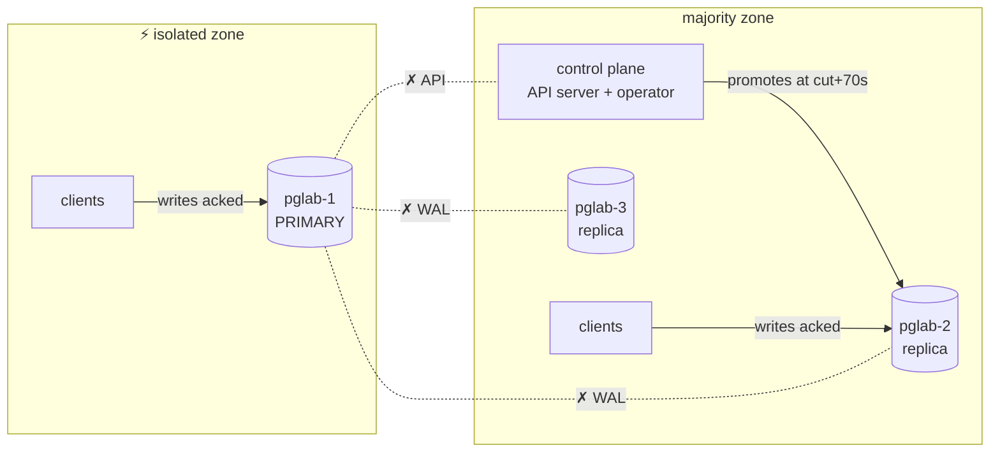
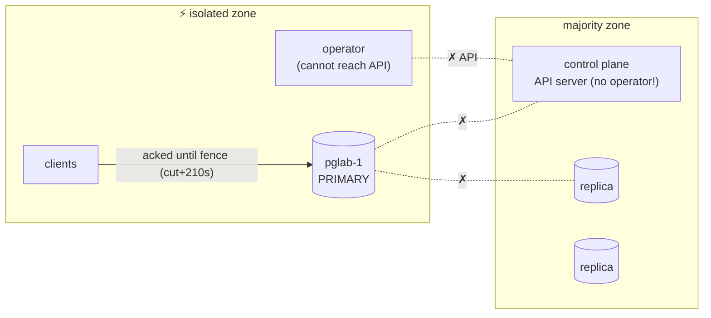
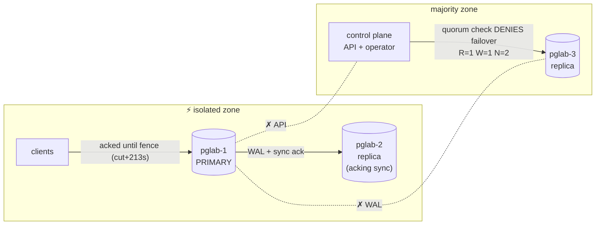
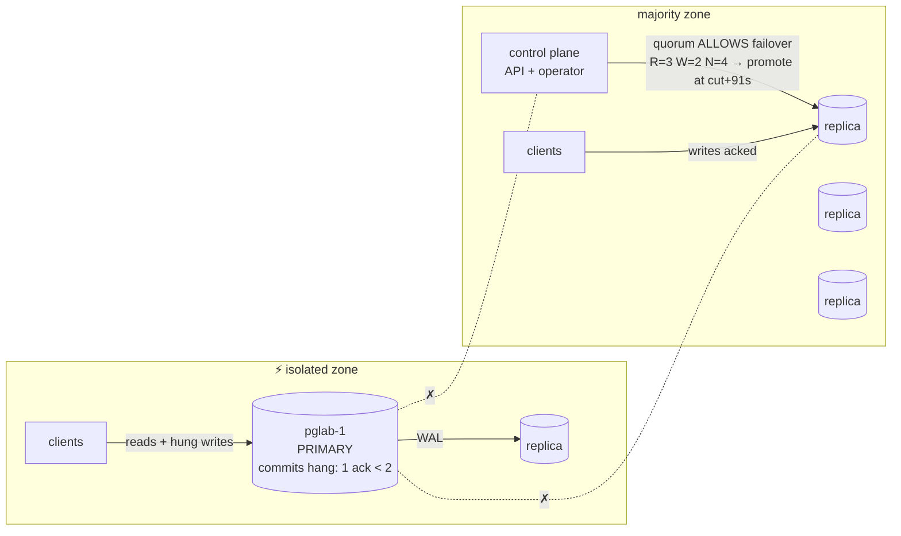
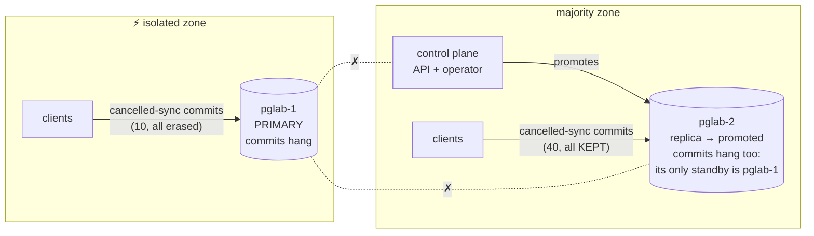
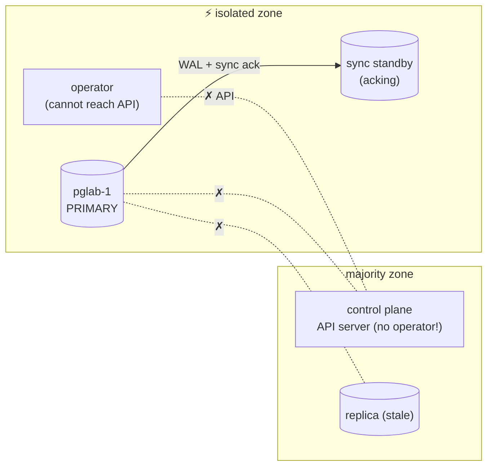

# Results

Measured behavior of CloudNativePG **1.30.0** under network partitions, per
scenario. All faults are full pairwise cuts (node IPs + pod CIDRs) held for
300s. Offsets are relative to `cut` (partition applied) and `heal`
(partition removed). See the [README](README.md) for invariants and
terminology; raw evidence for every run lives in `results/<run-id>/`.

Scenarios were renamed on 2026-08-23; run directories from before then carry
the old names: s01→async01, s05→async02, s02→sync01, s03→sync02,
s04→sync03, s06→sync04.

## Summary

| Scenario | Config | Lost clean acks | Dual-ack overlap | Write outage (% of fault) | Notes |
|---|---|---|---|---|---|
| async01 | async, defaults | **~850** | **~130s** | 0% | stays available by acking on two primaries at once |
| async02 | async, operator trapped | **~840 in 5/7 runs** | 0 | 38% `[cut+210 → heal+24]` | loss decided by a restart race at heal; acks never overlap |
| sync01 | sync any/1 + quorum | 0 | 0 | 37% `[cut+213 → heal+24]` | outage caused by the isolation fence |
| sync02 | sync any/2 + quorum | 0 | 0 | 30% `[cut+0 → promotion+91]` | promotion restores service mid-fault |
| sync03 | sync any/1, 2 nodes | 0 | 0 | 102% `[cut+0 → heal+6]` | structural: cannot write without the peer |
| sync04 | sync any/1 + quorum, operator trapped | 0 | 0 | 32–36% `[cut+207 → heal+4..16]` | heal race resolved safely (quorum + most-advanced selection) |

### Read-side anomalies per scenario

Column definitions, in plain words (full definitions in the
[README](README.md)):

- **Old primary answering after takeover** — how long the deposed primary
  kept answering clients after the new primary had already started
  acknowledging writes.
- **Reads of erased writes** — read operations that observed rows which do
  not exist after recovery: clients saw data that was later erased.
- **Cancelled-sync commits** — writes whose synchronous-replication wait was
  cancelled by a client timeout; PostgreSQL acknowledges them with a warning
  and only local durability. *Kept* = the row survived recovery; *erased* =
  it was destroyed.

| Scenario | Old primary answering after takeover | Reads of erased writes | Cancelled-sync commits kept / erased |
|---|---|---|---|
| async01 | **~130s** | ~850 over ~3.5 min | 0 / 0 |
| async02 | none (already stopped at takeover) | ~840 over ~3.5 min | 0 / 0 |
| sync01 | none (no takeover) | none | 0 / 0 |
| sync02 | **120s** | ~1600 over ~3m20s | 0 / **20** |
| sync03 | none (survivor blocked until heal) | ~400 over ~3.5 min | **40 / 10** |
| sync04 | none | none | 0 / 0 |

Patroni counterpart runs and the cross-stack comparison live in
[RESULTS-PATRONI.md](RESULTS-PATRONI.md).

Recurring signatures across all runs: the primary-isolation fence SIGTERMs at
~cut+30s but established sessions keep operating until ~cut+210s (the 180s
`smartShutdownTimeout` smart-shutdown grace); promotion, where allowed, lands
at ~cut+70..91s.

---

## async01 — async baseline, primary isolated

Config: `instances: 3`, no synchronous replication (the CNPG default and the
original [cloudnative-pg#7407](https://github.com/cloudnative-pg/cloudnative-pg/issues/7407)
reproduction). Harness-validation case: the checker must detect the loss.

**Measured (n=3, consistent):** promotion at cut+70s; old primary keeps
acking its zone until cut+207s (fence SIGTERM +30s, smart-shutdown grace
+180s) → **~130s with two acking primaries** and **~850 clean-acked writes
erased** by `pg_rewind` on heal; ~850 reads of erased writes. Write
availability never drops. Every anomaly sits inside the smart-shutdown grace:
with a fast shutdown on fencing, the fence (+30s) would beat promotion (+70s)
and this geometry would have no dual-ack window at all.

---

## async02 — async, operator trapped with the primary

Config: as async01, but the (single-replica) operator is re-pinned onto the
primary's node before the cut. Identical fault to async01; the only variable is
operator placement.

**Measured (n=7):** no promotion during the fault — automated recovery is
lost; the majority zone has replicas and an API server but no decision-maker.
The primary's zone is served until the fence (cut+210s), then total outage.
**The durability outcome is decided by a race at heal**: the returning
operator re-acquires leadership at ~heal+8s and promotes a stale replica at
~heal+24s, unless the fenced old primary's `wait-for-get-cluster` retry
happens to fire first and it resumes. Observed: **writes lost in 5/7 runs
(~840 each), survived in 2/7** — acked-write loss *without any dual-ack*,
via promote-past-unreachable-writes after the network is healthy again.
`.spec.failoverDelay` (default 0) would tilt this race toward survival.

---

## sync01 — sync + quorum, primary and its sync standby trapped together

Config: `instances: 3`, `synchronous: {method: any, number: 1,
dataDurability: required, failoverQuorum: true}`.

**Measured (n=2):** zero loss, zero dual-ack. The quorum check denied
promotion every reconcile cycle (logged: `R=1, W=1, N=2`) — correctly, since
the reachable replica may be missing acked commits. The trapped pair kept
serving *safely* until the isolation fence killed the primary at cut+213s
(all-peers semantics — the docs' any-peer wording implies it should NOT fence
here), producing a **37% outage that would be 0% under the documented
semantics**. On heal the same primary resumed; nothing was rewound.

---

## sync02 — sync + quorum, 5 nodes, primary and one replica trapped

Config: `instances: 5`, `synchronous: {method: any, number: 2,
dataDurability: required, failoverQuorum: true}`.

**Measured (n=2):** the strongest config's headline — **zero clean-ack loss,
zero dual-ack**. Clean acks freeze at the cut instant (write quorum
unreachable); quorum-approved promotion restores service at cut+91s (outage
30% of fault). Costs are visibility-side: the fenced old primary answers
reads for **120s** after takeover (deterministic: promotion ~+85s → fence
effective ~+205s), mints ~20 cancelled-sync commits (all erased), and its
zone observes ~1600 reads of erased writes.

---

## sync03 — sync, two nodes, primary isolated

Config: `instances: 2`, `synchronous: {method: any, number: 1,
dataDurability: required, failoverQuorum: true}`.

**Measured (n=2):** zero loss, zero dual-ack — promotion is always safe (the
survivor holds every acked commit) — but **write outage spans the entire
fault (102%)**: the promoted survivor cannot commit until the old primary
rejoins as its replica (first ack heal+6s). Unique to this cell: the
cancelled-sync-commit timeline split — the same client behavior yields
**kept** commits on the winning side (40) and **erased** ones on the losing
side (10).

---

## sync04 — sync + quorum, operator trapped with the primary

Config and fault: as sync01, with the async02 twist — the single-replica operator
re-pinned onto the primary's node before the cut. Tests whether the async02
heal-time race can lose acked writes when sync replication + failoverQuorum
are in play.

**Measured (n=4): zero loss in every run.** During the fault: identical to
sync01 (no promotion, fence at cut+207s). At heal the race went both ways —
the primary resumed first in 3/4 runs (heal+4..5s); in 1/4 the returning
operator won and **promoted at heal+16s, choosing the trapped sync standby**
(most-advanced reachable, holding every acked commit) rather than the stale
replica: zero acked writes lost, at the cost of ~11s extra outage and a
rewind of the old primary's unacked tail. The async02 loss mechanism is
defanged by sync+quorum: the quorum gate cannot pass against a partial
post-heal view, and LSN-ordered candidate selection picks the node that
acked. The heal-time race is therefore an async-only durability hazard.

---

## Findings worth raising upstream

1. **`smartShutdownTimeout` blunts every fencing path.** The isolation-check
   SIGTERM arrives at ~+30s as documented, but the termination path runs a
   *smart* shutdown (180s default) that only blocks new connections;
   established sessions keep writing (async01: the entire dual-ack window and all
   lost acks), reading, and minting cancelled-sync commits (sync01–async02).
   Effective fence latency is ~210s vs the documented "~30s". The instance
   manager knows its own isolation state, so "fast shutdown when fencing" is
   a plausible fix; lowering `.spec.smartShutdownTimeout` is the available
   mitigation (at the cost of blunt ordinary shutdowns).
2. **Isolation-check docs contradict the code.** Docs: fence when the
   primary "cannot reach **any** other instance". Code
   (`pinger.go ensureInstancesAreReachable`): fence unless it can reach
   **every** instance (first unreachable peer fails the probe). Behavioral
   consequence measured in sync01: an API-isolated primary with a healthy,
   acking sync standby gets fenced, converting a safe, quorum-protected
   partition into a 37% outage.
3. **The heal-time race (async02).** After a partition in which no failover
   could run, the operator promotes a stale replica within seconds of
   regaining API access, racing the fenced primary's restart — losing acked
   writes ~2/3 of the time in our environment, without split-brain. A grace
   period for a returning `targetPrimary` (or `failoverDelay` applying at
   heal) would close it. sync04 shows sync + `failoverQuorum` defangs the same
   race (n=4, zero loss, including one run where the operator won and
   correctly promoted the sync standby) — the hazard is async-only.
